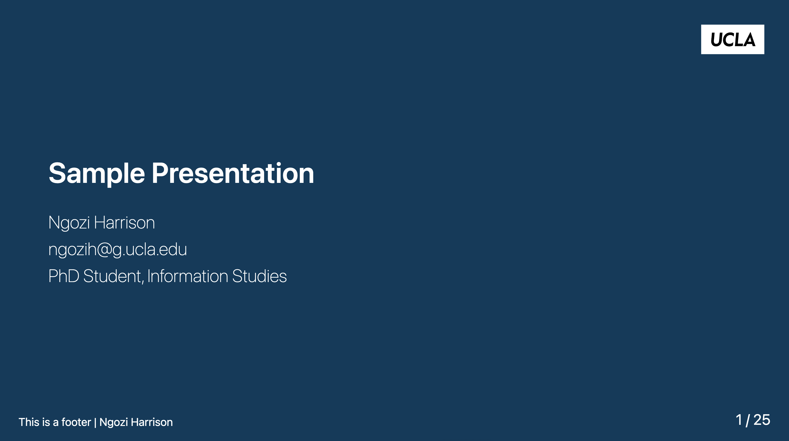

# Custom Marp Themes

[Marp](https://marp.app/) is a tool to build beautiful presentations using markdown. This is a repository of custom marp themes I've built. 



## ```UCLA```
- light and dark template with a clean modern look using UCLA colors
- inspired by https://github.com/hofbi/tum-marp-template


**How to Install**

download the css file
```
https://raw.githubusercontent.com/ngoziharrison/marp-themes/refs/heads/main/ucla.css
```

[NEED TO FINISH INSTRUCTIONS]

**How to use**

Add the following YAML to the beginning of your md file. If using the obsidian marp plugin then add to properties
```
---
marp: true
theme: ucla
---
```

For dark theme
```
---
marp: true
theme: ucla
class: invert
---
```


More themes coming soon!